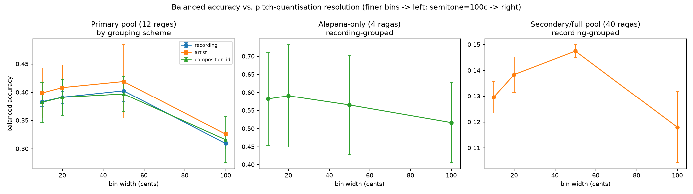

# Gamaka Floor

**How much does Carnatic raga identity survive once you throw away fine pitch
detail?**

A deep generative models study on Carnatic (South Indian classical) music. Raga
identity doesn't live only in which notes are sung — much of it lives in
**gamaka**, the slides, oscillations, and ornaments a singer applies around
each note. This project measures that empirically: take a raga classifier and
progressively blur its pitch input, from near-continuous measurement down to
a plain 12-semitone grid (piano notes), and watch how accuracy degrades. The
resulting curve quantifies how much raga identity sits *below* note-level
resolution.

Full plain-language write-up: **[`REPORT.md`](REPORT.md)**.
Full technical report with every figure/table/citation:
**[`notebooks/05_report.ipynb`](notebooks/05_report.ipynb)**.



## Headline result

Across every experiment configuration, the same pattern holds: accuracy stays
roughly flat (or ticks up slightly) as pitch resolution coarsens from fine
down to a moderate level, then drops clearly at the final step — forcing
pitch onto a 12-semitone grid.

| Test pool | Fine (10c) | 20c | 50c | Semitone (100c) | Chance |
|---|---|---|---|---|---|
| 4 ragas, unaccompanied singing | 0.582 | 0.590 | 0.565 | **0.516** | 0.25 |
| 12 ragas, all sections (recording-grouped) | 0.383 | 0.391 | 0.402 | **0.309** | 0.083 |
| 12 ragas, all sections (artist-grouped) | 0.398 | 0.408 | 0.419 | **0.326** | 0.083 |
| 12 ragas, all sections (composition-grouped) | 0.382 | 0.391 | 0.397 | **0.316** | 0.083 |
| 40 ragas, all sections (recording-grouped) | 0.130 | 0.138 | 0.147 | **0.118** | 0.025 |

*(Balanced accuracy, mean over cross-validation folds. See
[`status/STATUS_M2.md`](status/STATUS_M2.md) for full detail, std, and the
per-raga degradation ranking.)*

**Conclusion:** raga identity doesn't require extremely fine pitch
measurement to classify — but it does need *more* than 12 discrete notes.
Something real is lost the moment pitch is quantised to a semitone grid.

## What's in this repo

| Notebook | What it does |
|---|---|
| [`00_data_audit.ipynb`](notebooks/00_data_audit.ipynb) | Verifies annotation formats, resolves data-coverage questions, searches for a usable allied-raga pair |
| [`01_corpus_build.ipynb`](notebooks/01_corpus_build.ipynb) | Builds the cleaned pitch-contour corpora (per-raga, per-artist minute tables) |
| [`02_quantisation_study.ipynb`](notebooks/02_quantisation_study.ipynb) | **The spine.** Classifier accuracy vs. pitch resolution, across 5 experiment configs |
| [`03_allied_pair.ipynb`](notebooks/03_allied_pair.ipynb) | Documents why the allied-raga contrast was dropped (no artist-balanced pair exists in this dataset) and reuses the per-raga degradation ranking as a substitute |
| [`04_generator.ipynb`](notebooks/04_generator.ipynb) | A small proof-of-concept generative model producing raga-conditioned pitch contours, plus its evaluation (distributional match, classifier-called-raga, memorisation check) |
| [`05_report.ipynb`](notebooks/05_report.ipynb) | Assembles every result into one narrative, with musical interpretation sourced from documented Carnatic theory and a full limitations section |

Supporting files:

- **`dgm_utils.py`** — shared pipeline (pitch loading, cents conversion,
  cleaning, section-label handling, grouped cross-validation) imported by
  every notebook.
- **`artifacts/`** — every figure, CSV table, and the `numbers.json` metrics
  registry the report reads from, plus the generator's checkpoint and
  generated samples.
- **`status/STATUS_M0.md` … `STATUS_M6.md`** — a milestone-by-milestone build
  log, including a correction found during final verification (see
  `STATUS_M2.md`).
- **`CLAUDE.md`** — the standing decisions log: data facts, constraints, and
  rejected approaches, written for continuity across work sessions.
- **`SPEC.md`** — the original plan and acceptance criteria per milestone.
- **`prototypes/`** — early exploratory scripts, superseded by `dgm_utils.py`,
  kept for the record.

## Data

**[Saraga Carnatic Music Dataset 1.5](https://zenodo.org/record/4301737)**
(CC BY-NC-SA 4.0). Only the text annotations are used — pitch tracks, raga
labels, artist metadata, and section boundaries — not the audio itself.

`corpus/` and `corpus_allsections/` (the built pitch-contour corpora) are
**not** committed to this repo — they're derived, regenerable data, excluded
via `.gitignore`. Rebuild them by running `01_corpus_build.ipynb` against a
local copy of the Saraga annotations (see **Reproducing** below).

This repository's own content is shared under the same non-commercial,
attribution, share-alike terms as the source dataset.

## Reproducing

```bash
pip install -r requirements.txt
```

Each notebook resolves its data root from a candidate-path list at the top of
the setup cell (local path first, `/kaggle/input/...` fallback) — no manual
path edits needed beyond pointing it at your own copy of the Saraga
annotations.

Run order (each writes to `artifacts/` for the next to read):

```
00_data_audit → 01_corpus_build → 02_quantisation_study → 03_allied_pair → 04_generator → 05_report
```

Package versions this project was verified against are pinned in
[`requirements.txt`](requirements.txt).

## Key design decisions

- **Artist confound is first-class.** Several ragas in this dataset are
  dominated by a single singer. Every classification result either splits
  singers across train/test (artist-grouped cross-validation) or explicitly
  flags where that wasn't possible.
- **Composition confound**, for metered song sections: two recordings of the
  same composition would let a classifier learn the tune, not the raga —
  handled with composition-grouped CV and by excluding composition-degenerate
  ragas from the primary pool.
- **The allied-raga contrast was dropped**, not attempted anyway: an
  exhaustive search over the full dataset found no raga pair that is both
  musically allied and has balanced multi-artist coverage on both sides. The
  per-raga degradation ranking (§2 above) stands in as a broader,
  artist-balance-independent version of the same idea.
- **The generator is a disclosed proof-of-concept**, not a benchmark result —
  a small model (~57k parameters) trained on 2 ragas, evaluated on 6
  generated samples per raga, with an honest asymmetry (one raga generates
  distinctively, the other doesn't) reported rather than smoothed over.

## Limitations

Stated in full in [`REPORT.md`](REPORT.md) and
[`05_report.ipynb`](notebooks/05_report.ipynb) §5 — briefly: artist and
composition confounds, no leave-one-artist-out check for an allied pair (none
survived to test), mixed pitch-extraction sources at different frame rates,
a residual pitch-tracking artifact found during generator training, a small
single-dataset corpus, and the generator's disclosed quantisation blockiness.
